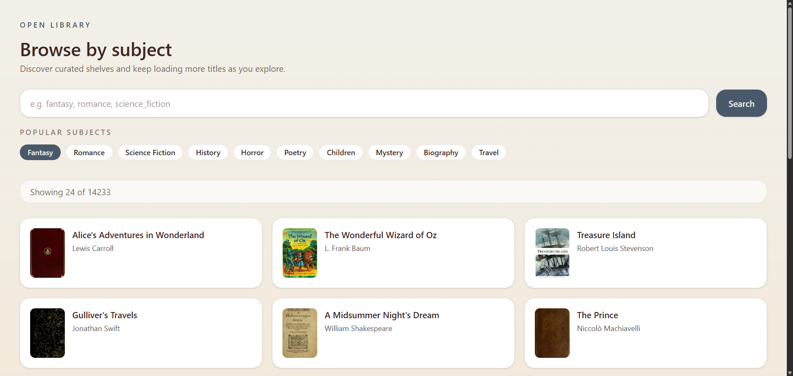

# Open Library App

Progetto portfolio Start2Impact: app Angular per esplorare libri di Open Library per subject, con paginazione manuale e pagina dettaglio opera.


_Nota: aggiungi lo screenshot reale in `docs/screenshot-subject.png`._

## Live Demo & Repository

- Live Demo: In arrivo (deploy in corso)
- Repo: https://github.com/AgataDiCalogero/open-library-app

## Features

- Browse by subject con search bar e chips "Popular subjects"
- Lista libri con cover da Open Library
- Pagina dettaglio opera con back deterministico tramite query `subject`
- Caching in-memory con repository pattern
- Loading state ed empty state
- Paginazione con `limit/offset` e bottone "Load more"

## Tech Stack

- Angular 21 standalone, Signals, Router input binding
- HttpClient con interceptor per error handling
- Tailwind CSS con theme tokens (`--color-brand`, `--color-paper`, `--color-ink`, `--color-wash`)
- Vitest + Angular TestBed, coverage via V8

## API

- Open Library Subjects API: https://openlibrary.org/dev/docs/api/subjects
- Supporto `limit`, `offset` e `work_count` per il totale risultati
- Work detail via endpoint `/works/:id.json`

## Project Structure

- `src/app/core/` - API client, DTO, error handling
- `src/app/features/` - feature "books" con components, data, pages
- `src/app/shared/` - modelli condivisi
- `src/environments/` - config ambienti
- `src/styles.css` - theme tokens Tailwind

## Architettura (perche cosi)

- `core/api` centralizza le chiamate e il mapping DTO -> domain per tenere pulite le pagine.
- `BooksRepository` gestisce cache in-memory e `shareReplay(1)` per evitare richieste duplicate.
- `features/books/pages` orchestrano lo stato (Signals) e la navigazione.
- `features/books/components` sono presentational, riusabili e senza logica di fetch.
- Router input binding semplifica il passaggio di parametri e query param alle pagine.
- La paginazione manuale limita le richieste cover e mantiene UX controllata.

## Scripts / Commands

```bash
npm i
npm start
npm run lint
npm run format
ng test --coverage
```

`ng test --coverage` genera la cartella `coverage/`.

## Testing

- `src/app/app.spec.ts` - bootstrap dell'app
- `src/app/core/api/open-library.api.spec.ts` - mapping API + query params `limit/offset`
- `src/app/features/books/data/books-repository.spec.ts` - cache per subject/limit/offset
- `src/app/features/books/pages/subject-page/subject-page.spec.ts` - empty state, render lista, load more

Coverage:
- `ng test --coverage`

## Deploy (Netlify)

- Build command: `npm run build`
- Publish directory: `dist/open-library-app`

SPA rewrite (in `_redirects` o `netlify.toml`):

```text
/* /index.html 200
```

## Known limitations

- Deep link su `/works/:id` senza `?subject` puo perdere la summary autori; la UI mostra fallback.

## Roadmap / Next steps

- Ordinamento risultati (per titolo o autore)
- Skeleton piu ricchi e coerenti con la griglia
- Miglioramenti ARIA e focus states
- Salvataggio preferiti in local storage

## English (short)

Angular 21 app to browse Open Library subjects with manual pagination and a work detail page. Built with standalone components, Signals, and Tailwind, with in-memory caching and Vitest coverage.
